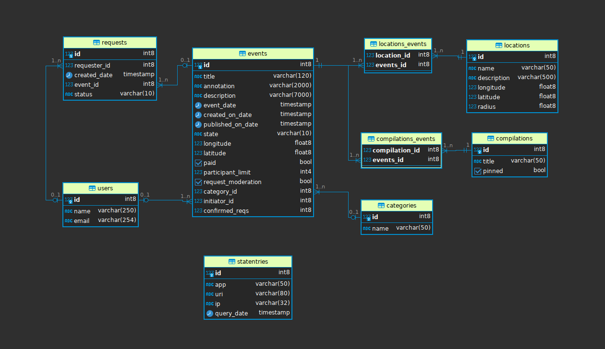

# java-explore-with-me

## Используемые технологии, инструменты, библиотеки

REST API, Java, Spring Boot, Spring Data JPA, Lombok, Postgres, SQL, Apache Maven, Docker, Postman, Swagger

# О чем это приложение?

Свободное время — ценный ресурс. Ежедневно мы планируем как его потратить — куда и с кем сходить. Сложнее всего 
в таком планировании - это поиск информации и переговоры. Нужно учесть много деталей: какие намечаются мероприятия, 
свободны ли в этот момент друзья, как всех пригласить и где собраться.

Приложение explore-with-me (англ. «исследуй со мной») реализует сервисы, которые позволяют пользователям делиться 
информацией об интересных событиях и находить компанию для участия в них. Это своего рода афиша, где можно предложить 
какое-либо событие - от выставки до похода в кино, и собрать компанию для участия в нём.

## Сервисы

Необходимый для работы программы функционал содержится в основном сервисе (модуль main) приложения, а в сервисе 
статистики (модуль stats) хранятся сведения о количестве просмотров событий, которые позволяют делать различные выборки 
для анализа работы приложения.

### Основной сервис

API основного сервиса представлен тремя частями:
- публичная - доступна без регистрации любому пользователю сети;
- закрытая - доступна только авторизованным пользователям;
- административная - для администраторов сервиса.

> *Аутентификация и авторизация.*
Предполагается, что оба сервиса приложения работают внутри виртуальной частной сети. С внешним миром сервисы связывает
сетевой шлюз. Он контактирует с системой аутентификации и авторизации, а затем перенаправляет запрос в сервисы.
То есть, если шлюз пропустил запрос к закрытой или административной части API, значит, этот запрос успешно прошел
аутентификацию и авторизацию.

####   Требования к публичному API

Публичный API предоставляет возможности поиска и фильтрации событий с учетом следующих моментов:
- сортировка списка событий организована либо по количеству просмотров, которое запрашивается в сервисе статистики,
либо по датам событий; 
- при просмотре списка событий возвращается только краткая информация о мероприятиях;
- просмотр подробной информации о конкретном событии выполняется отдельно (через отдельный эндпоинт);
- каждое событие относится к какой-то из закреплённых в приложении категорий;
- предоставляется возможность получения всех имеющихся категорий и подборок событий (такие подборки должны составляться
администраторами ресурса);
- получение списка локаций (города, театры, концертные залы и другие) с их координатами (широта, долгота, радиус),
возможность поиска событий в конкретной локации;
- каждый публичный запрос для получения списка событий или полной информации о мероприятии фиксируется сервисом
статистики.

####   Требования к API для авторизованных пользователей

Закрытая часть API реализует возможности зарегистрированных пользователей приложения, с учетом что:
- авторизованные пользователи имеют возможность добавлять в приложение новые мероприятия, редактировать их
и просматривать после добавления;
- предусмотрена подача заявок на участие в интересующих мероприятиях;
- создатель мероприятия имеет возможность подтверждать заявки, которые отправили другие пользователи сервиса.

####   Требования к API для администратора

Административная часть API предоставляет возможности настройки и поддержки работы сервиса, а именно:
- добавление, изменение и удаление категорий для событий;
- добавление, удаление и закрепление на главной странице подборок мероприятий;
- модерация событий, размещённых пользователями, - публикация или отклонение;
- добавление, изменение, удаление локаций с указанием их координат (широта, долгота, радиус);
- управление пользователями - добавление, активация, просмотр и удаление.

####   Жизненный цикл события
Жизненный цикл события включает несколько этапов.
1. Создание.
2. Ожидание публикации. В статус ожидания публикации событие переходит сразу после создания.
3. Публикация. В это состояние событие переводит администратор.
4. Отмена публикации. В это состояние событие переходит в двух случаях. Первый — если администратор решил,
что его нельзя публиковать. Второй — когда инициатор события решил отменить его на этапе ожидания публикации.

### Сервис статистики

Второй сервис — сервис статистики. Он собирает информацию о количестве обращений пользователей к спискам событий, 
а также о количестве запросов к подробной информации о событии. На основе этой информации формируется статистика 
о работе приложения.

Функционал сервиса статистики содержит:
- запись информации о том, что был обработан запрос к эндпоинту API;
- предоставление статистики за выбранные даты по выбранному эндпоинту.

Для использования сервиса статистики разработан с использованием класса RestTemplate, входящего в состав Spring 
Framework, HTTP-клиент для направления запросов к сервису и обработки от него ответов.

### Спецификации API

Для разработки обоих сервисов использовались подготовленные спецификации API:
- [спецификация API основного сервиса](openapi/ewm-main-service-spec.json "openapi/ewm-main-service-spec.json");
- [спецификация API сервиса статистики](openapi/ewm-stats-service-spec.json "openapi/ewm-stats-service-spec.json").

Для работы с ними целесообразно использовать редактор Swagger.

### Логическое представление базы данных

Логическая структура данных в базе представлена следующей диаграммой.

Основными сущностями базы данных являются:
- пользователи приложения (таблица users);
- события (таблица events);
- заявки на участие в событии (таблица requests);
- локации проведения событий (таблица locations);
- подборки событий, подготавливаемые администраторами приложения (таблица compilations);
- категории событий (таблица categories).

Между указанными сущностями существуют связи. 

Каждый пользователь может быть автором событий (связь между таблицами users-events) и выполнять по отношению к ним 
функции владельца (например, подтверждать участие в событии других пользователей). 

Пользователь может подавать запросы на участие в событиях, созданных другими пользователями (связь users-requests), при
этом запросы на участие связаны с соответсвующим событием через связь events-requests.

Событие может быть связано с локациями. Локации, параметры которых определяются зоной с определенным радиусом, 
могут пересекать друг друга, поэтому событие может принадлежать сразу к нескольким локациям. При этом несколько 
событий может происходить в одной локации, по этой причине между сущностями events и locations существует связь 
многие-ко-многим. Для реализации этой связи, чтобы перейти к отношениям один-ко-многим, создана промежуточная таблица 
locations_events.

Связь между сущностями events и compilations имеет аналогичный характер. Для реализации связи используется 
промежуточная таблица compilations_events. 

Событие может относиться к определнной категории (связь events-categories). Характер связи - один-ко-многим.

Отдельной сущностью, не связанной с остальными в базе, является статистическая запись (таблица statentries).

### Использование контейнеров для работы приложения

Приложение реализовано с элементами микросервисной архитектуры. В модуле main приложения реализован основной сервис, 
а в модуле stats - сервис статистики. Взаимодействие между сервисами осуществляется путем направления основным сервисом 
запросов для записи в сервис статистики и получения из него информации об обращении к определенным эндпойнатам 
основного сервиса через функционал клиента сервиса статистики в подмодуле client модуля stats. 
Для передачи информации используются http-запросы, направляемые с использованием класса RestTemplate фрэймворка Spring. 
Сохранение полученной информации в базе выполняет подмодуль service модуля stats. 

Для обеспечения загрузки программы в Docker-контейнерах подготовлены конфигурации в файлах docker-compose.yml
(в корневом каталоге проекта) и Dockerfile (в модулях main и stats). Для подготовки проекта к запуску
необходимо:
1. Выполнить компиляцию исходного кода проекта, для чего, находясь в корневом каталоге проекта, следует
   выполнить команду:  
   `$ mvn clean package`
2. Далее, находясь в корневом каталоге проекта, создать и запустить Docker-контейнеры с помощью команды:  
   `$ docker compose up`  
   В результате, будут загружены два Docker-контейнера, один для работы сервиса main, другой для работы сервиса stats.

Команда `$ docker compose down` остановит работу запущенных Docker-контейнеров.

### Тестирование

Для обнаружения ошибок и несоответствий, проверки функциональности проекта использовались подготовленные postman-тесты
(/postman/feature.json). 